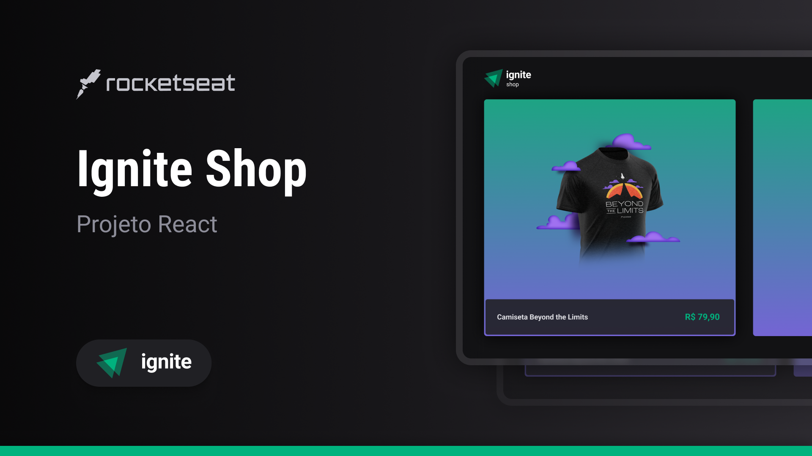

# Ignite Shop




Aplicação Marketplace desenvolvida no módulo: Fundamentos do Next.js do curso Ignite da Rocketseat

 [Sobre o Projeto](#-sobre-a-aplicação) | [Tecnologias](#-tecnologias-utilizadas) | [Layout](#-layout) | [Como executar a aplicação](#-como-executar-a-aplicação) |
 [Como contribuir](#-como-contribuir) | [Licença](#-licença) | [Autor](#-autor)

## 📄 Sobre a aplicação
A aplicação é um marketplace, onde o usuário poderá ver os produtos, adicionar aos carrinhos até fazer o checkout, onde será redirecionado para a página de pagamento do stripe.

### Features da aplicação
- Requisitos funcionais
	- Listagem de produtos
	- Visualizar os detalhes sobre os produtos
	- Adicionar os produtos no carrinho de compras
	- Remover os produtos do carrinho de compras
	- Realizar o pagamento de sua compra
	- Receber uma mensagem de sucesso


## 🧑‍💻 Tecnologias utilizadas
 [](https://react.dev/)
 [](https://react.dev/)
 []((https://www.radix-ui.com/))

## 🎨 Layout
Para acessar o layout da aplicação, você precisará ter uma conta criada no [Figma](https://www.figma.com). 

Caso já tenha uma conta acesse clicando no link abaixo:

- [Layout do Figma](https://www.figma.com/file/FxlDRKOmznBbTH8DsTgnZU/Ignite-Shop-2.0/duplicate)

## 🚀 Como executar a aplicação
- Clone esse repositório
```
git clone https://github.com/andersondev96/ignite-shop
```
- Acesse a pasta do projeto:
```
cd ignite-shop
```
- Instale as dependências
```
npm install
```
- Renomeie o arquivo `.env.local.example` para `.env` e utilize as suas próprias chaves.
```
cp .env.local.example .env
```
- Execute a aplicação:
```
npm run dev
```
- A aplicação será executada na porta `3000`, utilize o *brower* de sua preferência.

## 🤝 Como contribuir?
- Faça um *fork* desse repositório.
- Crie uma *branch* com a sua feature: `git checkout -b my-feature`.
- Faça um commit das suas alterações: `git commit -m 'feat: My new feature'`.
- Faça um push para a sua branch: `git clone origin my-feature`.

Depois que o *merge* da sua *pull request* for feito, você poderá deletar a sua *branch*.

## 📝 Licença
Esse projeta está sobre a licensa [MINT](MIT)

## 👥 Autor


**Anderson Fernandes Ferreira**

[](https://instagram.com/anderson_ff13)
[](mailto:andersonfferreira96@gmail.com.br)
[](https://www.linkedin.com/in/anderson-fernandes96/)

Feito com 💚 por Anderson Fernandes 👋 [Entre em contato!](https://www.linkedin.com/in/anderson-fernandes96/)
